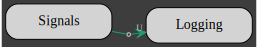
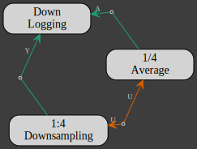
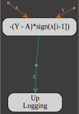
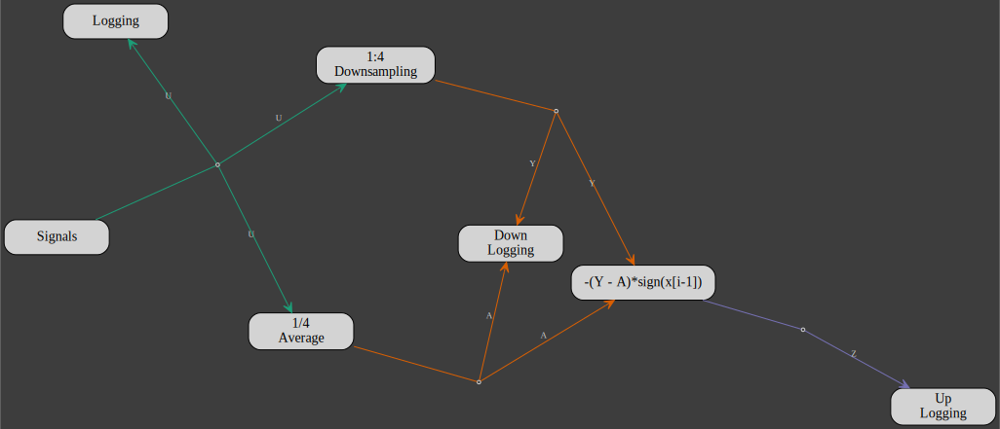

# Aggregation

Aggregation refers to the process of generating a larger model from existing models and actors.
The aggregation function is implemented with the [Add](https://doc.rust-lang.org/std/ops/trait.Add.html) trait.

For example, the actors in the [multirate](../clients/multirate/multirate.md) section could have been sorted out according to their sampling rates into 3 different models
 * 1
 ```rust,no_run,noplayground
{{#include ../../../examples/aggregation.rs:nominal-sampling-rate}}
```


 * `DOWNRATE`
  ```rust,no_run,noplayground
{{#include ../../../examples/aggregation.rs:quarter-sampling-rate}}
```


 * `UPRATE`
  ```rust,no_run,noplayground
{{#include ../../../examples/aggregation.rs:half-sampling-rate}}
```


The complete model is then written:
  ```rust,no_run,noplayground
{{#include ../../../examples/aggregation.rs:model}}
```


Aggregation applies to both actors and models with the same outcome: a new model.
Below is the table of the types that can be aggregated into a model:

| `LHS` | + | `RHS` | = | `Add::Output` |
|:-----:|:-:|:-----:|:-:|:-------------:|
| `Model`| + | `Model`| = | `Model` |
| `Model`| + | `Actor`| = | `Model` |
| `Actor`| + | `Model`| = | `Model` |
| `Actor`| + | `Actor`| = | `Model` |