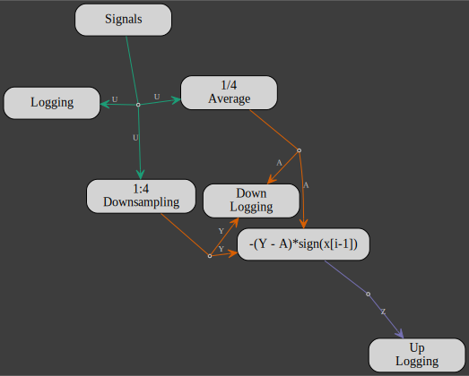
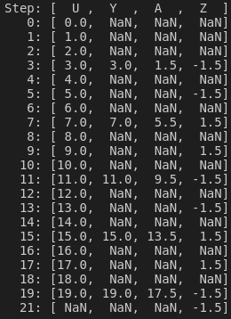

# Multirate System

A multirate system mixes signals sampled at different rates.
The flowchart below is a depiction of such a system implemented with `gmt_dos-actors` where the sample rates of the inputs and outputs (IO) are color coded according to the following table:

| green | orange | purple |
|:-----:|:------:|:------:|
| 1 | 1/4 | 1/2 |



The purple IO and orange IO are, respectively, 1/2 and 1/4 the sampling rate of the green IO as show in the outputs record:



Any actor with different inputs (`NI`) and outputs (`NO`) sampling rates implements a rate transition.
`NI` and `NO` are given as ratios with respect to the highest sampling rate, e.g. for the green IO: `NI=NO=1` , for the orange IO: `NI=NO=4` and for the purple IO: `NI=NO=2`.
If `NO>NI`, the outputs are downsampled, meaning that there is a set of outputs only every `NO/NI` samples.
If `NI>NO`, the outputs are upsampled with a zero-order hold, meaning that the outputs are repeated for `NI/NO` samples.

In any case, downsampling and upsampling,
the `Update`method of the actor's client is invoked at the input rate.

The `gmt_dos-actors` implementation of the multirate system above starts by setting the downsampling and upsampling rates:
```rust,no_run,noplayground
{{#include ../../../../examples/multirate.rs:rates}}
```

The input signal is a ramp (a * i + b) starting a 0 with unitary step increments:
```rust,no_run,noplayground
{{#include ../../../../examples/multirate.rs:signal}}
```

A rate transition can be imposed with the [Sampler](https://docs.rs/gmt_dos-actors/latest/gmt_dos_actors/clients/struct.Sampler.html) client.
Here the inout signal (`NI=1`) is downsampled according to `NO=DOWNRATE`
 ```rust,no_run,noplayground
{{#include ../../../../examples/multirate.rs:downsampling}}
```

Downsampling is also the results of the [Average](https://docs.rs/gmt_dos-actors/latest/gmt_dos_actors/clients/struct.Average.html) client which averages the input over `NO/NI` samples:
```rust,no_run,noplayground
{{#include ../../../../examples/multirate.rs:average}}
```

The downsampled and averaged signals, both with the same sampling rate (`DOWNRATE`), are recombined with the `SignedDiff` client which computes the difference between both signals and alternates the output sign.
By setting the output rates to `NO=UPRATE`, an upsampling rate transition will occur:
```rust,no_run,noplayground
{{#include ../../../../examples/multirate.rs:signed_diff}}
```

In the next step, we define 3 loggers, one for each sampling rate:
 * 1
 ```rust,no_run,noplayground
{{#include ../../../../examples/multirate.rs:logging}}
```
 * `DOWNRATE`
  ```rust,no_run,noplayground
{{#include ../../../../examples/multirate.rs:downlogging}}
```
 * `UPRATE`
  ```rust,no_run,noplayground
{{#include ../../../../examples/multirate.rs:uplogging}}
```

Then it's a matter of defining inputs and outputs:
  ```rust,no_run,noplayground
{{#include ../../../../examples/multirate.rs:io}}
```
 building the network:
  ```rust,no_run,noplayground
{{#include ../../../../examples/multirate.rs:network}}
```
and running the model:
  ```rust,no_run,noplayground
{{#include ../../../../examples/multirate.rs:model}}
```

Finally, the logged ouputs are synchronized by post-proccessing the saved data while remembering that if the sampling rate of the ramp signal is 1 and its time step is `i`, then the time step of the downsampled and upsampled signals are derived from `DOWNRATE * (i + 1) - 1` and `UPRATE * i + DOWNRATE - 1`, respectively.
  ```rust,no_run,noplayground
{{#include ../../../../examples/multirate.rs:log}}
```


#### Implementation of the `SignedDiff` client:
```rust,no_run,noplayground
{{#include ../../../../examples/multirate.rs:sdiff_client}}
```