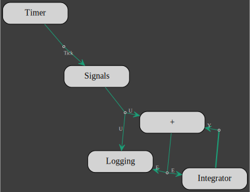
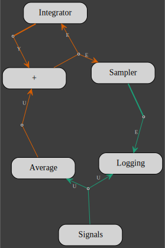
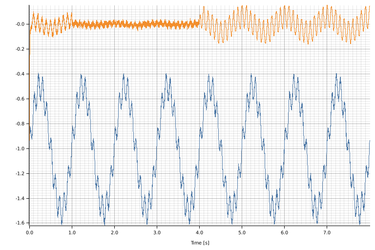
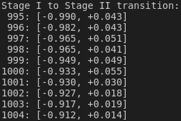
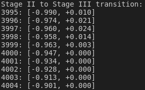
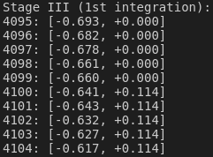

# Persistence

Persistence refers to the notion that the state of a client is *reachable* after a model execution.
Once a model has ended, the actors within the model have been consumed but some clients are still available.
They are the clients from actors that have been given the client pointer and not the client itself. 
We have already witnessed the persistence of the clients in the previous section with the `Logging` clients from which data is processed after the models have been terminated.

In the following, we are going to make use of this property of the clients to update a model at different stage of its execution.

The model is a feedback loop system which is bootstrapped with a low gain (0.2) for 1s, then the gain is increased to 0.5 for another 3s and finally the sampling rate of the feedback loop is reduced to 1/100th for the rest of the simulation. 

Lets first define the simulation sampling frequency (1kHz) and the durations of the 3 stages of the simulation:
```rust,no_run,noplayground
{{#include ../../../../examples/persistence.rs:params}}
```
The parameters above are used to defined the number of samples for each stage:
```rust,no_run,noplayground
{{#include ../../../../examples/persistence.rs:stage_n_step}}
```

The input signal is the sum of 3 signals: 2 sinusoides and some white noise:
```rust,no_run,noplayground
{{#include ../../../../examples/persistence.rs:signal}}
```
Next we set the other 2 persistent clients for:
 * the feedback integral control with the gain set to default (0)
```rust,no_run,noplayground
{{#include ../../../../examples/persistence.rs:integrator}}
```
 * and data logging 
```rust,no_run,noplayground
{{#include ../../../../examples/persistence.rs:logging}}
```

For stage I and II, the models are the same, only the gain of the integral controller is updated to 0.2 for stage I and to 0.5 for stage II.
So we define a [closure](https://doc.rust-lang.org/rust-by-example/fn/closures.html) that represents the model template for stage I and II:
```rust,no_run,noplayground
{{#include ../../../../examples/persistence.rs:closure}}
```
The only argument to the closure is the duration `n` of each stage.
In addition to the actors of the `signal`, `integrator` and `logging` clients, actors for the `Timer` and the `Sum` clients were added.
The `Sum` client is the same that the one introduces in the [FeedBack System](../feedback/feedback.md) section.

The model for stage I and II looks like this:



## Stage I

For stage I, we create the model with the appropriate duration, set the integrator gain and run the model:
```rust,no_run,noplayground
{{#include ../../../../examples/persistence.rs:stage_i}}
```

## Stage II

For stage II, we also start by creating the model with the appropriate duration, then we wait for stage I to finish before setting the integrator gain for stage II and running the model with the updated gain:
```rust,no_run,noplayground
{{#include ../../../../examples/persistence.rs:stage_ii}}
```

## Stage III

For stage III, the feedback loop sampling rate is reduced by a factor 100:
```rust,no_run,noplayground
{{#include ../../../../examples/persistence.rs:stage_iii_feedback_rate}}
```
The input signal is average over 100 samples and the output signal is upsampled by a factor 100 as well.
Considering the above, the stage III actors are:
```rust,no_run,noplayground
{{#include ../../../../examples/persistence.rs:stage_iii_actors}}
```
We removed the `Timer` client and added actors for the `Average` and `Sampler` clients and we are still using the same `Signals`, `Integrator` and `Logging` clients but in the state they will be at the end of stage II.

The stage III network is build next:
```rust,no_run,noplayground
{{#include ../../../../examples/persistence.rs:stage_iii_network}}
```


The `Sampler` output had to be bootstrapped as the input is delayed by 100 samples.
That is the reason why the `Sampler` has been creating with a default input value:
```rust,no_run,noplayground
{{#include ../../../../examples/persistence.rs:sampler}}
```


Finally, we create the new model, waiting for stage II to finish before running it:
```rust,no_run,noplayground
{{#include ../../../../examples/persistence.rs:stage_iii_model}}
```

The logged data is plotted with:
```rust,no_run,noplayground
{{#include ../../../../examples/persistence.rs:plotting}}
```
The blue curve is the input signal (U) and the orange curve is the residual signal (E) at the output of the sum.



The data corresponding to the transition for one stage to the next is displayed with:
 * stage I to stage II transition:
 ```rust,no_run,noplayground
{{#include ../../../../examples/persistence.rs:transition_i-ii}}
```

 * stage II to stage III transition:
 ```rust,no_run,noplayground
{{#include ../../../../examples/persistence.rs:transition_ii-iii}}
```


and the data accross the end of the 1st integration of stage III
 ```rust,no_run,noplayground
{{#include ../../../../examples/persistence.rs:stage-iii_int}}
```

