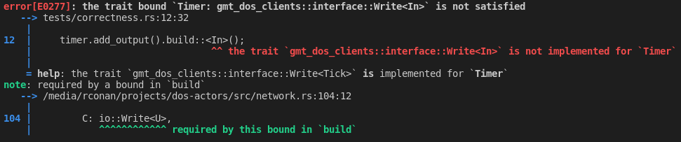
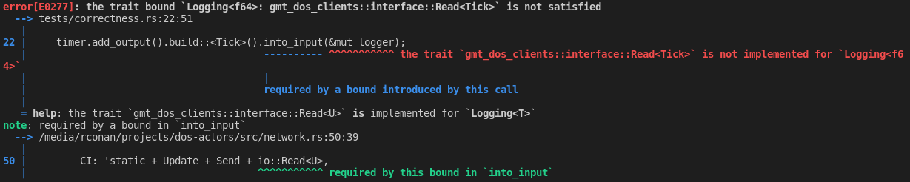
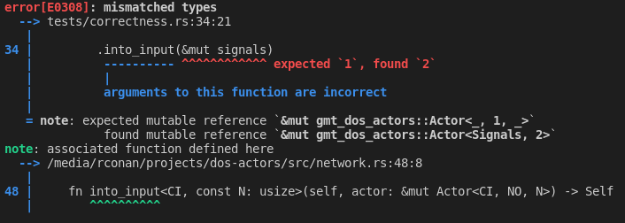
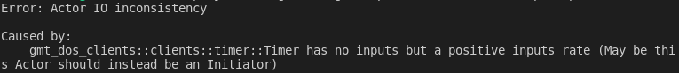
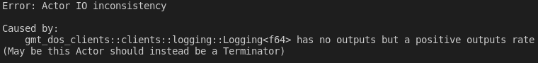
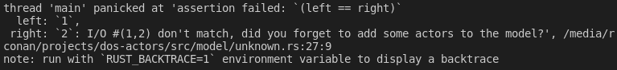

# Correctness

Correctness, in the context of the GMT Actors Model, refers to the verification process that checks for error in the code written by the user of the `gmt-dos-actor` API.
The code is checked for mistakes both at compiled-time and at runtime. 
This formal process makes developping an integrated model with `gmt-dos-actor` very safe as it ensures that the likehood of having written a "correct" model is very high.

A "correct' model is a model build with Rust code that complies the following:
 * a pair of input and output must have the same `UID`,
 * a pair of input and output must have the same sampling rate: `NI=NO`,
 * an actor with an input sampling rate `NI=0` must have no input,
 * an actor with an input sampling rate `NI>0` must have at least one input,
 * an actor with an output sampling rate `NO=0` must have no output,
 * an actor with an output sampling rate `NO>0` must have at least one output,
 * in a model, taking into account all actors, there must be as many inputs as outputs,
 * in a model, taking into account all actors, the sum of inputs hashes must be equal to the sum of the outputs hashes.

 If the code doesn't comply with any of the aboves, either it won't compile sucessfully or it will panic before the model is run.

For rapid troubleshooting it is important to be able to associate error messages with the corresponding compliance clause.
In the following, we give examples of a faulty code, with the generated error messsage, for some of the compliance clauses:

 * a pair of input and output must have the same `UID`
```rust,no_run,noplayground
{{#include ../../../tests/correctness.rs:uid_input_clause}}
``` 

```rust,no_run,noplayground
{{#include ../../../tests/correctness.rs:uid_output_clause}}
``` 


 * a pair of input and output must have the same sampling rate: `NI=NO`
```rust,no_run,noplayground
{{#include ../../../tests/correctness.rs:rate_clause}}
``` 


* an actor with an input sampling rate `NI>0` must have at least one input
```rust,no_run,noplayground
{{#include ../../../examples/correctness.rs:noinputs_positiverate_clause}}
``` 


 * an actor with an output sampling rate `NO>0` must have at least one output,
```rust,no_run,noplayground
{{#include ../../../examples/correctness.rs:nooutputs_positiverate_clause}}
``` 


 * in a model, taking into account all actors, there must be as many inputs as outputs,
```rust,no_run,noplayground
{{#include ../../../examples/correctness.rs:inputs_outputs_number_mismatch_clause}}
``` 
