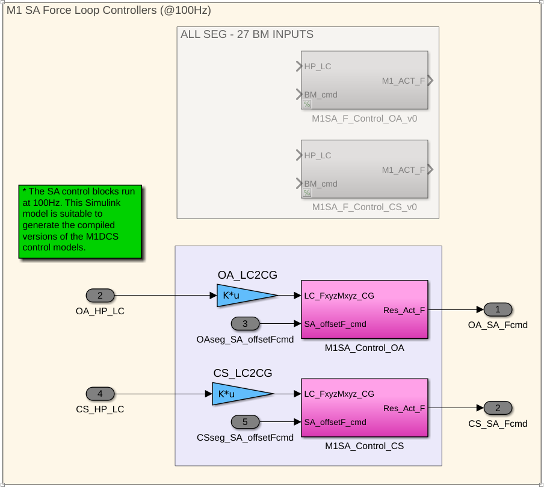
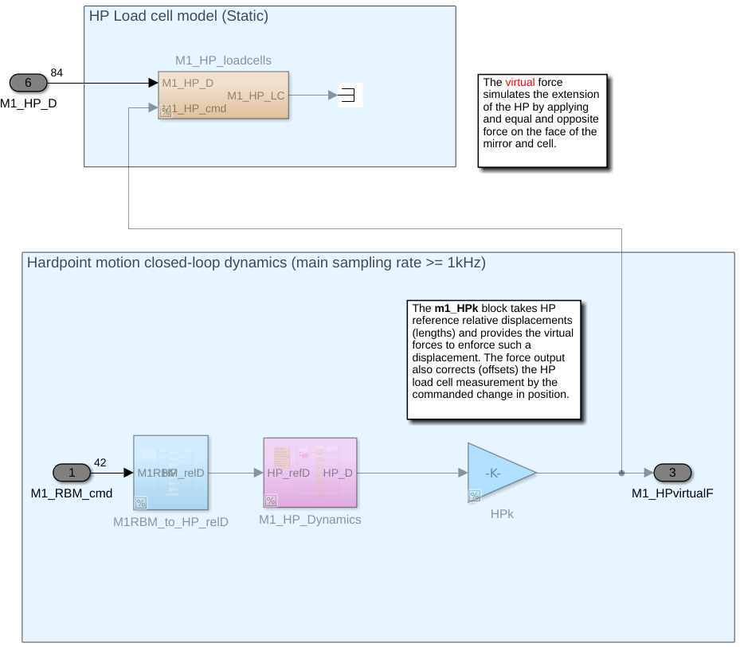

# M1 Control System

The M1 control system is made of 3 controllers for the hardpoints, for the actuators of the center segment and for the actuators of the outer segment.

|||||
|-|-|-|-|
| `gmt_dos-clients_m1-ctrl`| [crates.io](https://crates.io/crates/gmt_dos-clients_m1-ctrl) | [docs.rs](https://docs.rs/gmt_dos-clients_m1-ctrl) | [github](https://github.com/rconan/dos-actors/tree/main/clients/m1-ctrl) |
| `gmt_m1-ctrl_hardpoints-dynamics`| [crates.io](https://crates.io/crates/gmt_m1-ctrl_hardpoints-dynamics) | [docs.rs](https://docs.rs/gmt_m1-ctrl_hardpoints-dynamics) | [github](https://github.com/rconan/m1-ctrl/tree/main/hardpoints) |
| `gmt_m1-ctrl_center-actuators`| [crates.io](https://crates.io/crates/gmt_m1-ctrl_center-actuators) | [docs.rs](https://docs.rs/gmt_m1-ctrl_center-actuators) | [github](https://github.com/rconan/m1-ctrl/tree/main/actuators/center) |
| `gmt_m1-ctrl_outer-actuators`| [crates.io](https://crates.io/crates/gmt_m1-ctrl_outer-actuators) | [docs.rs](https://docs.rs/gmt_m1-ctrl_outer-actuators) | [github](https://github.com/rconan/m1-ctrl/tree/main/actuators/outer) |