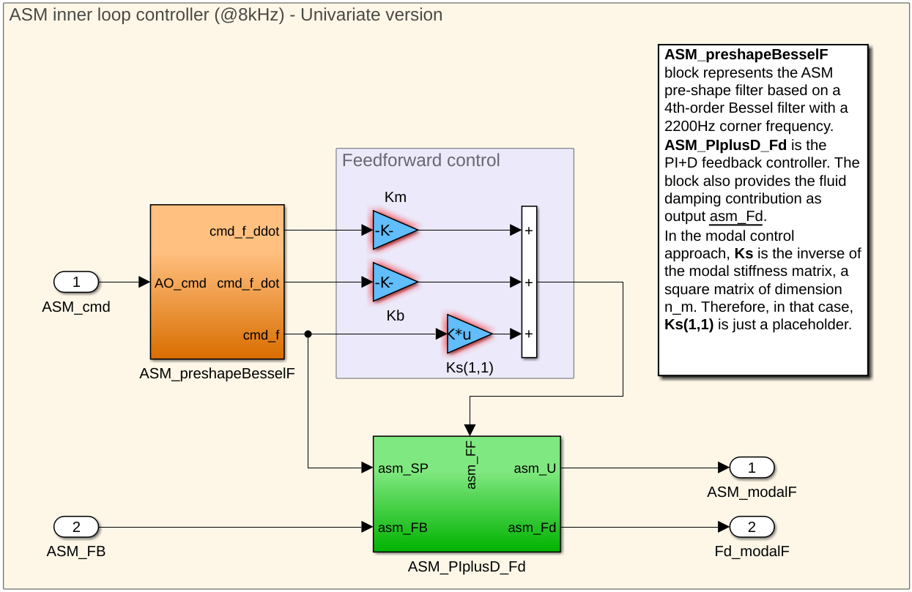
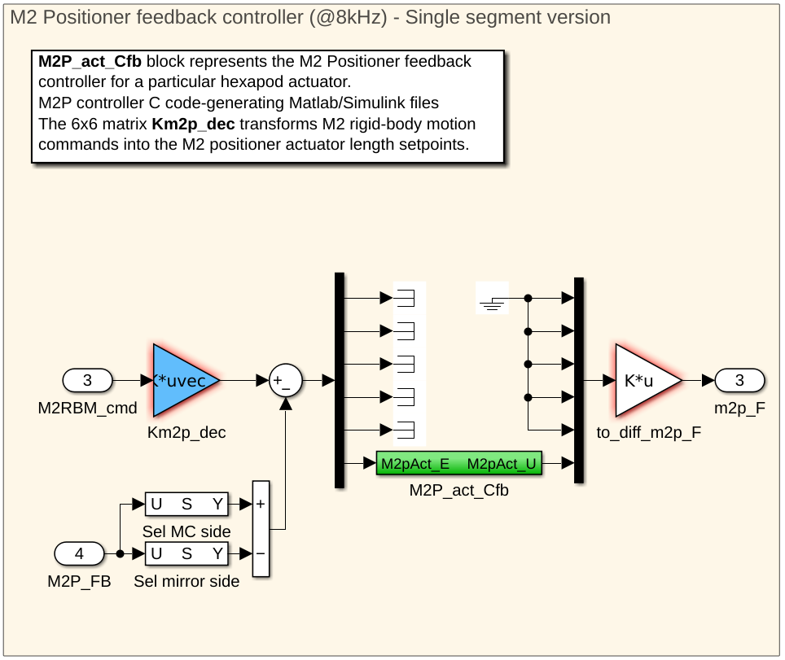

# ASM Control System 

The M2 control system is made of 3 controllers for the ASM preshape filter, for the ASM fluid damping model and for the ASM positionners.

 * DOS Client

 |||||
|-|-|-|-|
| `gmt_dos-clients_m2-ctrl`| [crates.io](https://crates.io/crates/gmt_dos-clients_m2-ctrl) | [docs.rs](https://docs.rs/gmt_dos-clients_m2-ctrl) | [github](https://github.com/rconan/dos-actors/tree/main/clients/m2-ctrl) |

 * Controllers

|||||
|-|-|-|-|
| `gmt_m2-ctrl_asm_preshape-filter`| [crates.io](https://crates.io/crates/gmt_m2-ctrl_asm_preshape-filter) | [docs.rs](https://docs.rs/gmt_m2-ctrl_asm_preshape-filter) | [github](https://github.com/rconan/gmt-controllers/tree/main/m2-ctrl/asm/preshape-filter) |
| `gmt_m2-ctrl_asm_pid-damping`| [crates.io](https://crates.io/crates/gmt_m2-ctrl_asm_pid-damping) | [docs.rs](https://docs.rs/gmt_m2-ctrl_asm_pid-damping) | [github](https://github.com/rconan/gmt-controllers/tree/main/m2-ctrl/asm/pid-damping) |
|  |
| `gmt_m2-ctrl_asm_positionner`| [crates.io](https://crates.io/crates/gmt_m2-ctrl_asm_positionner) | [docs.rs](https://docs.rs/gmt_m2-ctrl_asm_positionner) | [github](https://github.com/rconan/gmt-controllers/tree/main/m2-ctrl/asm/positionner) |
|  |

## `AsmSegmentInnerController<ID>` IO 

| Types | Read | Write | Size |
| ----- |:----:|:-----:|:----:|
| `gmt_m2::asm::segment::VoiceCoilsForces<ID>` | - | `X` | `675` |
| `gmt_m2::asm::segment::VoiceCoilsMotion<ID>` | `X` | - | `675` |
| `gmt_m2::asm::segment::FluidDampingForces<ID>` | - | `X` | `675` |
| `gmt_m2::asm::segment::AsmCommand<ID>` | `X` | - | - |
