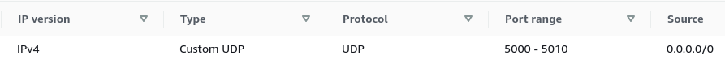

# GMT DOS Actors Scope

`gmt_dos-clients_scope` is a client/server graphical display implementation for [gmt_dos-actors](https://docs.rs/gmt_dos-actors/) models.

The communication between the client and the server is secured with a signed certificate
that must be provided by the server.
The authentification certificate is generated by calling `crypto` into a terminal on the server.
`crypto` is installed with
```text
cargo install --bin crypto gmt_dos-clients_transceiver
```
The generated certificate `gmt_dos-clients_transceiver_cert.der` must be uploaded onto the client machine.

`gmt_dos-clients_scope` has 2 features: `server` and `client` (default).
The `server` feature need to be enabled only on the server applications while disabling the `client` feature:

```shell
cargo add gmt_dos-clients_scope --no-default-features --features=server
```

## AWS EC2 Instance Setup

To stream data to a local scope from an AWS EC2 instance, a new inbound rule needs to be added to the Security Group of the instance, a rule with the UDP protocol, a port or a port range, and any IPv4 source selected, for example:



AWS EC2 instances have 2 IPs, a local or private IP and a public IP.
The IPs can be found from the AWS dashboard or from a terminal connected to the instance by running: `ec2metadata | grep ip`.

To check that the new rule of the Security Group is set up properly, on the instance listen to one of the UDP port with
```shell
netcat -luv 5001
```
and on the local machine send a message to the instance UDP port with 
```shell
echo "hello world" | netcat -uv <instance-public-ip> 5001
```
On the instance, the following should be written at the prompt:
```shell
Connection from <your-machine-ip> <your-machine-port> received!
hello world
```

The instance local IP is assigned to the scope server whereas the instance public IP is assigned to the scope client.