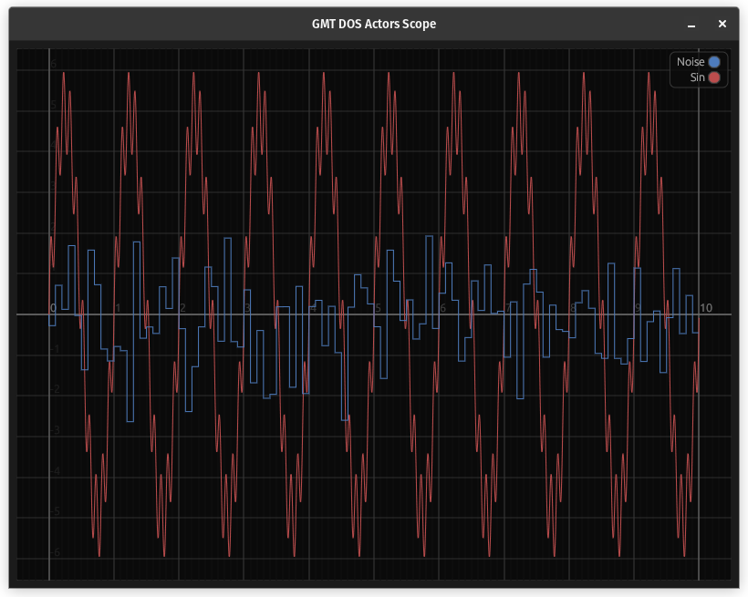
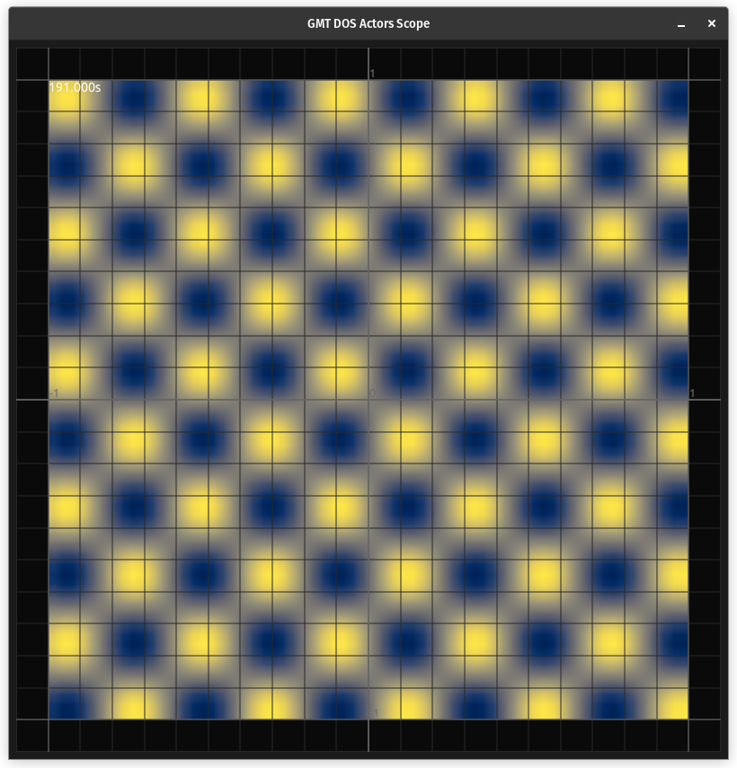

# Examples

## Scope

All examples are using data from the same server, that is run with
```text
RUST_LOG=info cargo run --no-default-features --features server --example tx
```

### async

Asynchronous scope using [tokio](https://tokio.rs/) runtime:

```text
RUST_LOG=info cargo run --example async
```

### async-macro

Same as `async` but defining the scope with a procedural function macro:

```text
RUST_LOG=info cargo run --example async-macro
```



## Shot

### Server

```text
RUST_LOG=info cargo run --release --example sinsin --features server --no-default-features
```

### Client

```text
RUST_LOG=info cargo run --release --example async_shot
```




## NICE-DCV

If [NICE-DCV](https://aws.amazon.com/hpc/dcv/) is installed on the remote server, the client can be run on the server as well.

First check if the DCV server is up and running:
```shell
sudo systemctl status dcvserver.service
```
then if some DCV sessions are already set
```shell
dcv list-sessions
```
and if not, create a new session:
```shell
dcv create-session --storage-root %home% 1
```